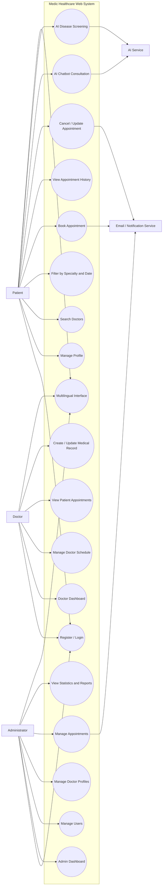
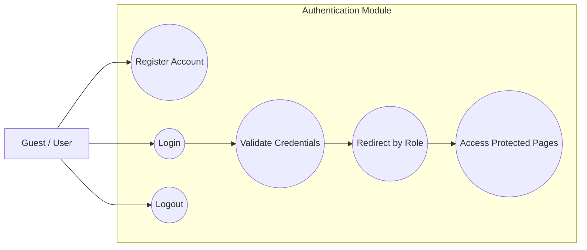
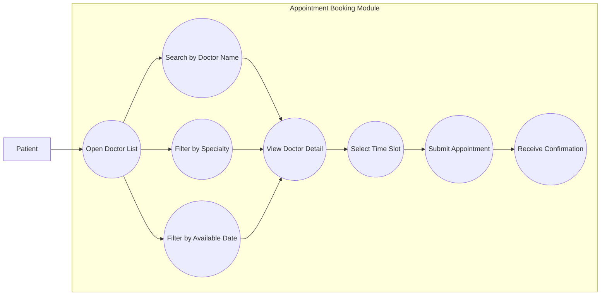
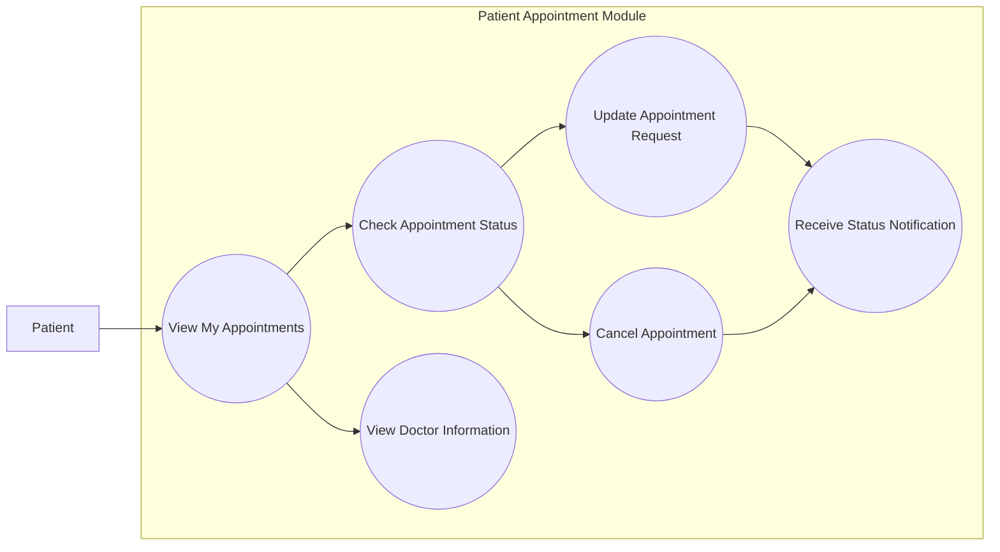
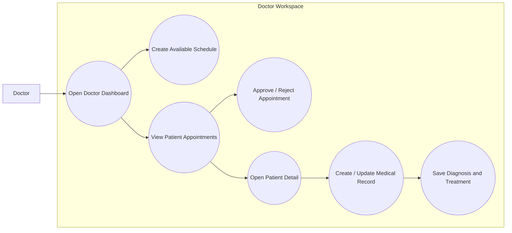
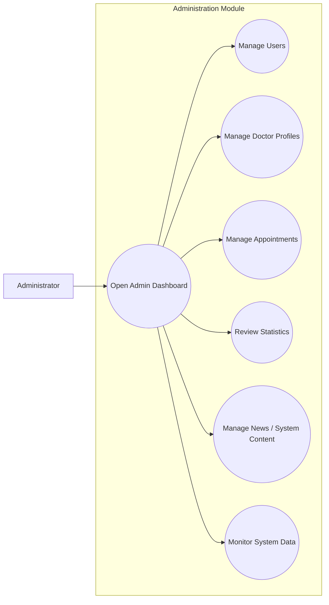
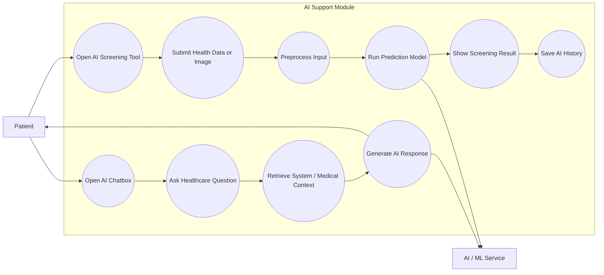
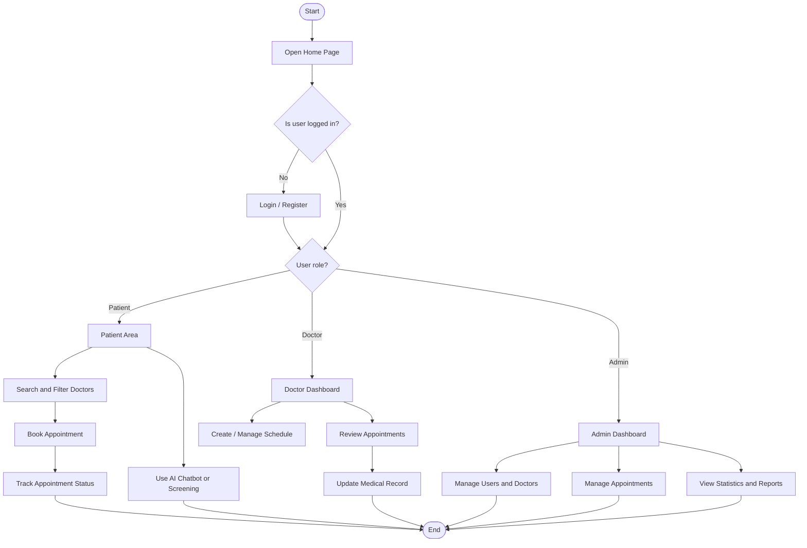
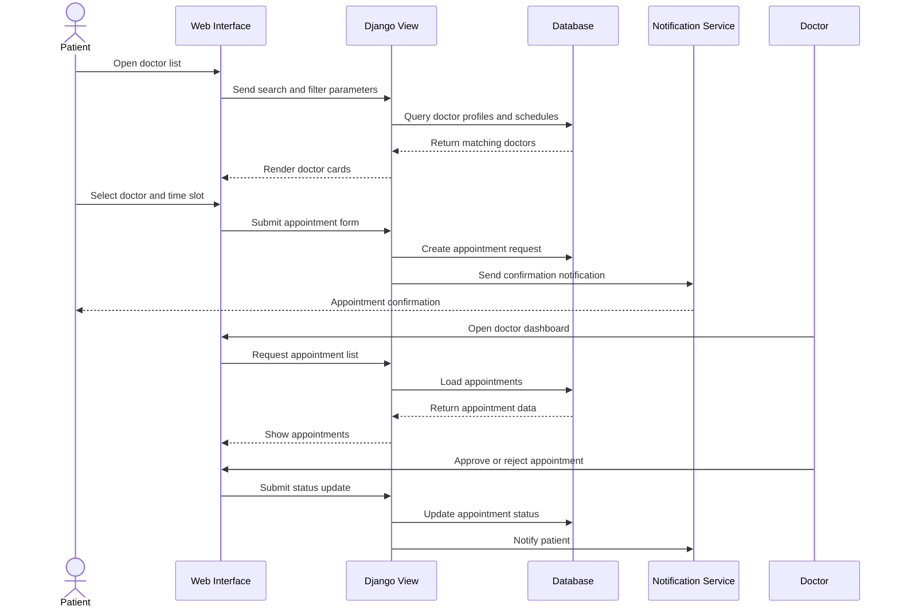

# Medic Project - Use Case And Workflow Diagrams

This document is prepared for the graduation presentation. Diagram labels are in English so they can be used directly in slides.

## 1. Overall Use Case Diagram



## 2. Detailed Use Case 1 - Authentication And Role Access



| Field | Description |
|---|---|
| Main actor | Guest, Patient, Doctor, Administrator |
| Goal | Allow users to securely access the correct area based on their role. |
| Precondition | The user has an account or can register a new account. |
| Main flow | User opens login page -> enters credentials -> system validates account -> system redirects to the correct dashboard. |
| Alternative flow | Invalid credentials -> system shows an error message and asks the user to try again. |
| Result | The user accesses only the pages allowed for their role. |

## 3. Detailed Use Case 2 - Search Doctors And Book Appointment



| Field | Description |
|---|---|
| Main actor | Patient |
| Goal | Help patients find a suitable doctor and book an appointment. |
| Precondition | Doctor profiles and schedules already exist in the system. |
| Main flow | Patient opens doctor page -> searches or filters doctors -> selects a doctor -> chooses a time slot -> submits appointment form. |
| Alternative flow | No doctor matches the filters -> system shows an empty state and allows viewing all doctors. |
| Result | A new appointment request is created and stored in the database. |

## 4. Detailed Use Case 3 - Patient Appointment Management



| Field | Description |
|---|---|
| Main actor | Patient |
| Goal | Let patients track and manage their appointment requests. |
| Precondition | The patient is logged in and has at least one appointment. |
| Main flow | Patient opens appointment history -> checks status -> views doctor and schedule details. |
| Alternative flow | Patient cancels or requests an update before the allowed deadline. |
| Result | Appointment data is updated and the patient can follow the latest status. |

## 5. Detailed Use Case 4 - Doctor Schedule And Medical Record Management



| Field | Description |
|---|---|
| Main actor | Doctor |
| Goal | Help doctors manage schedules, appointments, and patient medical data. |
| Precondition | The doctor is logged in and has a doctor profile. |
| Main flow | Doctor opens dashboard -> creates schedule -> reviews appointment list -> confirms patient visit -> updates medical record. |
| Alternative flow | Appointment is invalid or unavailable -> doctor rejects or asks for a different time. |
| Result | Doctor schedule and medical records are updated in the system. |

## 6. Detailed Use Case 5 - Admin System Management



| Field | Description |
|---|---|
| Main actor | Administrator |
| Goal | Control and maintain the main data of the healthcare system. |
| Precondition | The administrator is logged in with admin permission. |
| Main flow | Admin opens dashboard -> manages users, doctors, appointments, and system content -> reviews statistics. |
| Alternative flow | Invalid input -> system validates the form and shows errors. |
| Result | System data stays consistent and manageable. |

## 7. Detailed Use Case 6 - AI Assistant And AI Screening



| Field | Description |
|---|---|
| Main actor | Patient |
| Supporting actor | AI / ML service |
| Goal | Provide quick healthcare support and preliminary screening. |
| Precondition | AI model or chatbot service is available. |
| Main flow | Patient asks a question or uploads data -> system processes input -> AI generates a response or prediction -> result is shown to the user. |
| Alternative flow | AI model is unavailable -> system shows a friendly fallback message. |
| Result | User receives AI-supported information, but the result is not a final medical diagnosis. |

## 8. Main System Workflow



## 9. Appointment Booking Workflow



## 10. Short Presentation Script

Use this short explanation while showing the diagrams:

```text
This is the overall use case diagram of my system. The system has three main actors: patient, doctor, and administrator. Patients can search doctors, book appointments, manage appointment history, and use AI tools. Doctors can manage schedules, review appointments, and update medical records. Administrators can manage users, doctor profiles, appointments, and system statistics.

The system workflow starts from the home page. After authentication, the system redirects users based on their role. Each role has a different dashboard and different permissions. This role-based design helps protect data and makes the workflow clear for each type of user.

For the appointment workflow, the patient searches and filters doctors, selects an available time slot, and submits an appointment request. The system stores the request in the database and sends a notification. Then the doctor can review and approve or reject the appointment from the doctor dashboard.

The AI module is designed as a support feature. It includes chatbot consultation and preliminary screening. It does not replace doctors, but it helps users receive initial guidance before meeting medical professionals.
```
